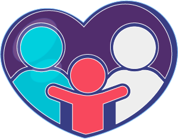
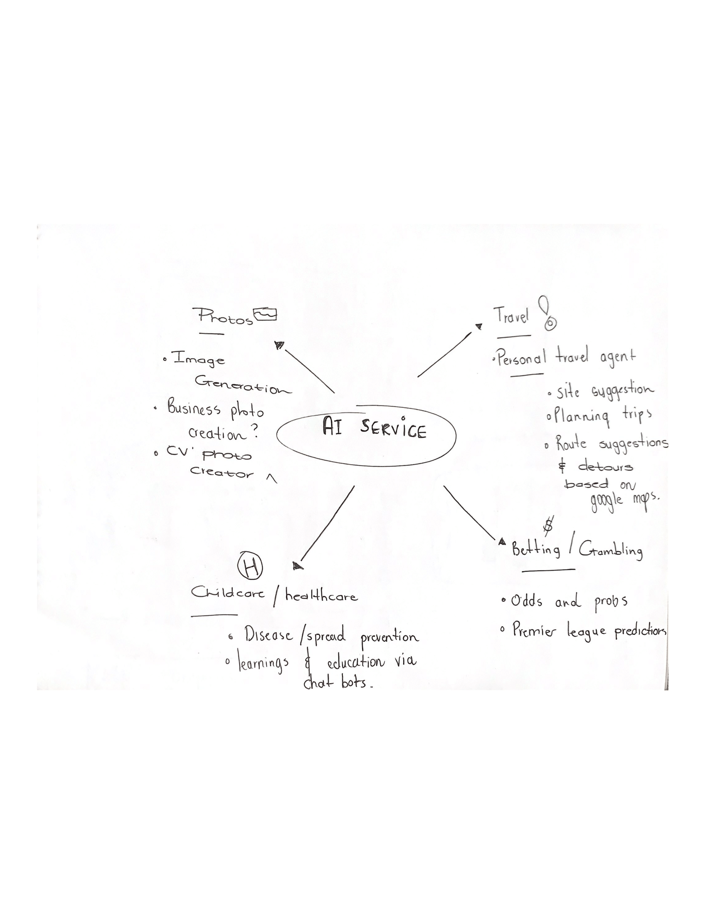

<!-- Repository Information & Links-->
<br />


<!-- HEADER SECTION -->
<h5 align="center" style="padding:0;margin:0;">Liam Wedge</h5>
<h5 align="center" style="padding:0;margin:0;">21100218</h5>
<h6 align="center">DV300 - Term 4 | 2023</h6>
</br>
<p align="center">

  <a href="https://github.com/NoSleepTillLambos/KinderCare">
    
  </a>
  
  <h3 align="center">Kinder Care</h3>

  <p align="center">
   A kid friendly, user centred interactive website specifically designed with the sole purpose of educating young children about diseases & illnesses <br>
    
   <br />
   <a href="https://drive.google.com/drive/folders/1bHFGq7nIGPdDqJGrCNNCiSqTUyPk-h7F">View Demo</a>
    ·
    <a href="https://github.com/NoSleepTillLambos/KinderCare">Report Bug</a>
    ·
    
</p>
<!-- TABLE OF CONTENTS -->

## Table of Contents

- [Getting Started](#getting-started)
  - [Prerequisites](#prerequisites)
  - [How to install](#how-to-install)
- [Features and Functionality](#features-and-functionality)
- [Concept Process](#concept-process)
  - [Ideation](#ideation)
  - [WireFrames](#wireframes)
  - [Custom UI](#user-flow)
- [Development Process](#development-process)
  - [Implementation Process](#implementation-process)
  - [Future Implementation](#peer-reviews)
- [Final Outcome](#final-outcome)
  - [Mockups](#mockups)
  - [Video Demonstration](#video-demonstration)
- [Conclusion](#conclusion)
- [License](#license)
- [Contact](liamwedge00@gmail.com)
- [Acknowledgements](#acknowledgements)

<!-- header image of project -->


### Project Description

<p align="center">Kindercare is a safe place for kids to learn more about their diseases and illnesses and read more about the kind of symptoms and experiences they may be having that are similar to other kids on the platform to let them know they are not alone </p>

### Technologies


## Getting Started

The following instructions will get you a copy of the project up and running on your local machine for development and testing purposes.

### Prerequisites

Ensure that you have the latest version of [NPM](https://www.npmjs.com/) installed on your machine. The [GitHub Desktop](https://desktop.github.com/) program will also be required.

### How to install

### Installation

Here are a couple of ways to clone this repo:

1.  GitHub Desktop </br>
    Enter `https://github.com/NoSleepTillLambos/KinderCare` into the URL field and press the `Clone` button.

2.  Clone Repository </br>
    Run the following in the command-line to clone the project:

    ```sh
    git clone https://github.com/NoSleepTillLambos/KinderCare
    ```

        Open `Software` and select `File | Open...` from the menu. Select cloned directory and press `Open` button

3.  Install Dependencies </br>
    Run the following in the command-line to install all the required dependencies:

    ```sh
    npm install
    ```

4.  An API key is not required for this installation

<!-- FEATURES AND FUNCTIONALITY-->
<!-- You can add the links to all of your imagery at the bottom of the file as references -->

## Features and Functionality

<!-- note how you can use your gitHub link. Just make a path to your assets folder -->


- Users can select a pre existing competition where they can go on to vote and comment on other entries

### Feature 2


- Home page, users are introduced to the app and can then move to the create entry screen where they can enter into a cocktail comp and compete

### Feature 3


- Users can create a cocktail entry by uploading the details and an image of their creation, along with some details about the ingredients and other important information so users can try the recipes at home for themselves!
- Users being able to try the cocktails out is the entire premise of the app, teaching keen learners a new hobbie!

<!-- CONCEPT PROCESS -->
<!-- Briefly explain your concept ideation process -->
<!-- here you will add things like wireframing, data structure planning, anything that shows your process. You need to include images-->

## Concept Process 💡

**I took a lot of inspiration froma concept i saw previously from a company that showcased one of their ideas for an app they had developed early this year, the app was a hands on childs healthcare VR and AR setup where kids in hospitals could use VR to visit a virtual island where animals taught them about their diseases and the problems they were having, i found the app to be very inuitive, the UX and UI was just so inspiring i had to put it to the test and see what i could develop myself!**



### Road Map and conceptual process 📍


<!-- DEVELOPMENT PROCESS -->

## Development Process

***Attitude over aptitude*** 

### Implementation Process ⌛

<!-- This is your time to shine, explain the technical nuances of your project, how did you achieve the final outcome!-->

- Implementation started in the third week of the term when i knew the project i wanted to create and the void i knew i wanted to fill in the market of healthcare and education 

### Peer review report 📝

**These are some of the findings i made during my feedback session**

</img>

### Future Implementation 🔮

<!-- stipulate functionality and improvements that can be implemented in the future. -->

- I would love to include some additional AI implementation, giving the kids thea ability to have a more hands on approach with a bot
- Fine tune the API and fine tune the model even more to create a more kid friendly environment
- I also saw a great option for a friendly & formal bot, and the ability to switch between the two from a classmate of mine that would be really cool to implement

<!-- MOCKUPS -->

## Final Outcome

### Mockups


<br>


<!-- VIDEO DEMONSTRATION -->

### Video Demonstration

To see a run through of the application, please click below:

[View Demonstration](https://drive.google.com/drive/folders/1IiMC4ZpDRhs8Q5RuAk9rlZmzaHfeihNa)

See the [open issues](https://github.com/NoSleepTillLambos/KinderCare/issues) for a list of proposed features (and known issues).

<!-- AUTHORS -->

## Authors

[LiamWedge](https://github.com/NoSleepTillLambos)

<!-- LICENSE -->

## License

Distributed under the MIT License. See `LICENSE` for more information.\

<!-- LICENSE -->

## Contact

***Liam Wedge*** - [liamwedge00@gmail.com]()
***Kinder Care*** - [https://github.com/NoSleepTillLambos/KinderCare]()

<!-- ACKNOWLEDGEMENTS -->

## Acknowledgements:

***Technology***
<br></br>


***Illustration***
</br>
<!-- all resources that you used and Acknowledgements here -->
- [Open Doodles](https://www.opendoodles.com/) (Awesome free doodles and drawings that gave me that fun and intuitive edge in my project)
